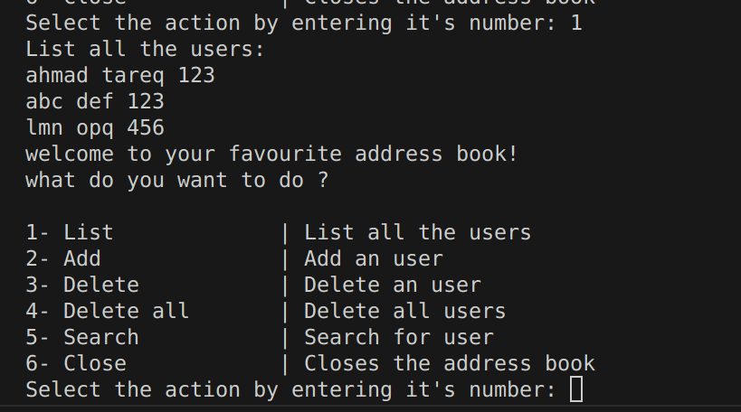
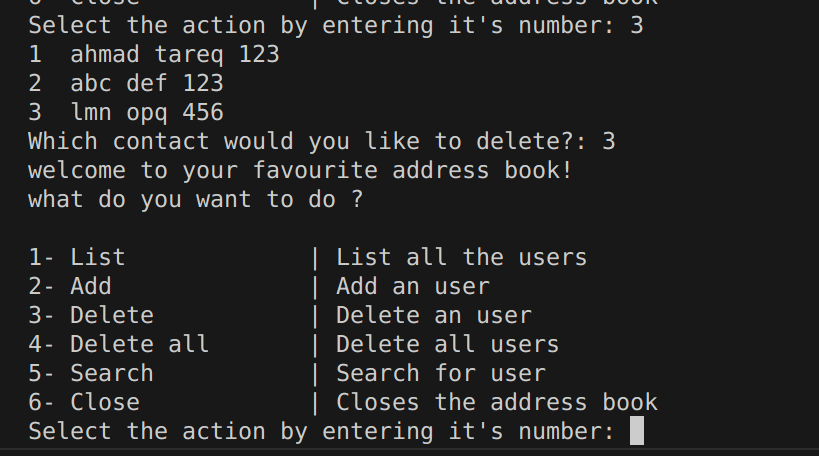
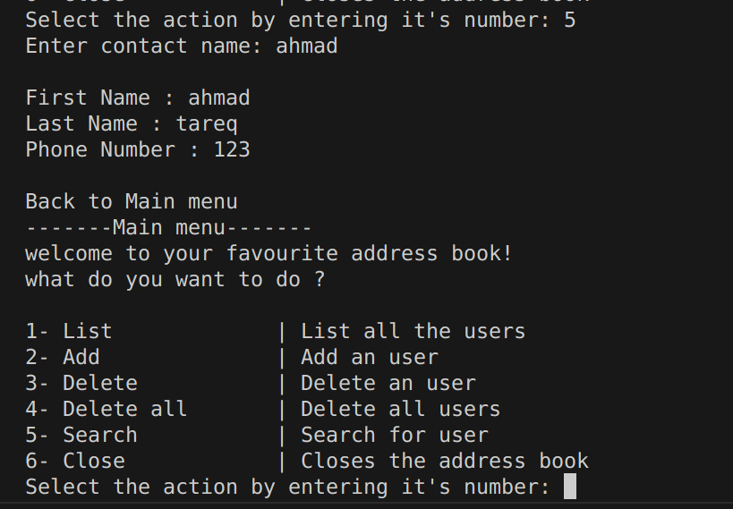

# Lec7 Tasks

## 1- Max number in array
```
arr1 = [1,2,3,4,5]
```
```
max number = 5
```
## 2- Search number in array
```
arr1 = [1,2,3,4,5]
search for 3
```
```
3 is found 
```
```
arr1 = [1,2,3,4,5]
search for 12
```
```
12 is not in the array 
```

## 3- Delete element
```
Array Elements: 1 2 3 4 5 6 
Enter index of element, starting from 1: 1
2 3 4 5 6 
```
## 4- Merge array
```
arr1=[1,2,3]
arr2=[4,5]
```
```
1,2,3,4,5
```

## 5- Find even and odd
```
arr1 = [1,2,3,4,5]
```
```
Even numbers :2 4 
Odd numbers :1 3 5
```
## 6- Square number 
```
Enter number: 3
9
```

## 7- Sort 
```
arr = {23,6,134,1,34}; 
```
```
Ascending order: 1 6 23 34 134 
Descending order: 134 34 23 6 1 
```

## 8- Simple Addressbook


## Images






## Links

##
