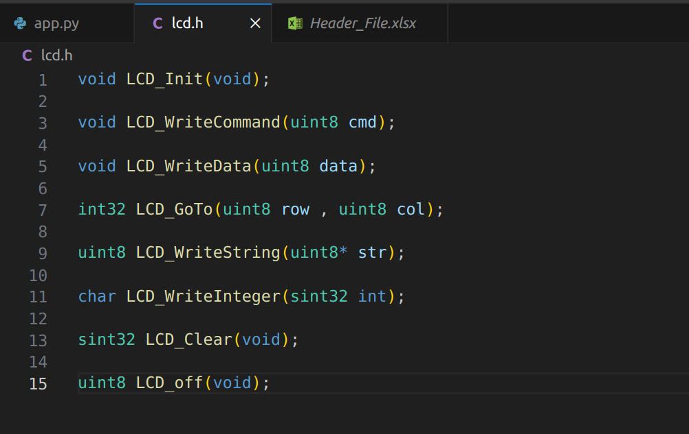
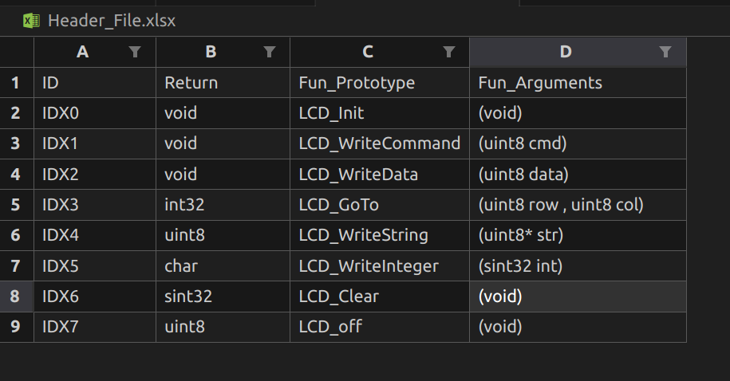

# Lec4_Tasks

## Task1 *Write a Python program to count the number of lines in a text file.*:

### file content:

```
Hi
My name is 
Bye
```

```
output:
3
```

##
## Task2 *write a Python program to count the Number of words in a file.*:

Here I used auto paragraph generator so every time you run the program a file is created with random content.
```
hello my name is
```
```
output:
4
```
##
## Task3 *Write a Python program to write a \u201clist\u201d to a file.*:
```
lecs = ['lec1','lec2','lec3','lec4']
```
```
output:
lec1 lec2 lec3 lec4
```
##
## Task4 *Write python code to generate Init function of GPIO for AVR*:

```
Here you can enter number of bits and a loop iterate to generate a binary value to access the bits.
```

```
input:
Enter number of bits: 8
Enter bit0 mode: in
Enter bit1 mode: out
Enter bit2 mode: in
Enter bit3 mode: out
Enter bit4 mode: in
Enter bit5 mode: out
Enter bit6 mode: in
Enter bit7 mode: out
```
```
output:
void Init_void (void)
{
DDRA = 0b10101010
}
```
##
## Task5 *Using Pyautogui to open Emails and change Emails from unread to read*

```
To change from unread to read
```
##
## Task6 *Run this code (% Battery and make Notification)*
##
## Task7 *Write a Python program to get the command-line arguments*
```
input -> python3 cmdLine_Arguments.py ab cd ef gh
output-> Number of Arguments: 5
Argument Lists: ['cmdLine_Arguments.py', 'ab', 'cd', 'ef', 'gh']
```
##
## Task8 *Python program to parse header file and read all prototypes*

## *Header File contains functions*



## *Excel file contains functions with arguments, return type, Unique Id, and Prototypes*




##
## Task9 *voice assitant*

##


